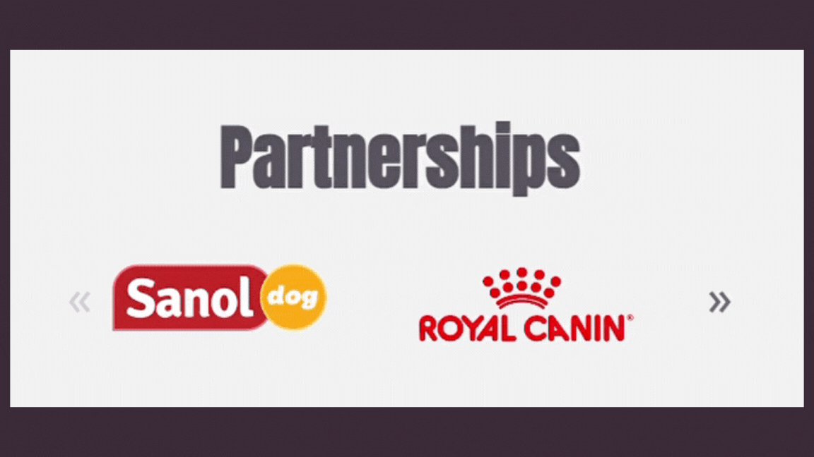

# 🐾 TRUE FRIEND 🐾
## We care for all pets 🐈‍⬛
>Explore True Friend's landing page, the company committed to providing the highest level of care for your pet. With a delicate and engaging layout, this page delivers a unique experience, enriched by exclusive features carefully designed to ensure user satisfaction.
<br>

## Preview
<div align="center">
  
</div> <br>

## Technologies used in the project
<div align="left">
  
  
  
  
  
  
  
</div>
<br>

## Features and Details

- The project's design was developed adopting a **"mobile-first"** approach, enabling the creation of a responsive page with minimal interventions through media queries. This also ensures a smooth and practical browsing experience, even on mobile devices.
<div align="center">
  
</div><br>
<div align="center">
  
</div><br><br>

- The implementation of **glider.js** allowed the creation of a lightweight, fast slider that is fully compatible with mobile devices, dependency-free, and provides complete accessibility through keyboard navigation.
<div align="center">
  
</div><br><br>

- Use of **container-type buttons** to give greater emphasis to the action, complemented by visual feedback through **hover and active events**.
<div align="center">
  
</div><br><br>

- Implementation of the "Services" section to provide **quick and intuitive navigation** through various sections of the page, all with just one click.
<div align="center">
  
</div><br><br>

- Application of the **Animate On Scroll Library (AOS)**, enabling the integration of animations that appear as the user scrolls through the page. This contributes to the creation of a visually engaging and attractive webpage.
<div align="center">
  
</div><br><br>

## Running the application 🏃🏻‍♀️
```bash
  npm run dev
```
<br>

## Deploy 💻
The project was deployed using the Vercel platform and is available at the [link](https://true-friend.vercel.app/)
<br><br>
